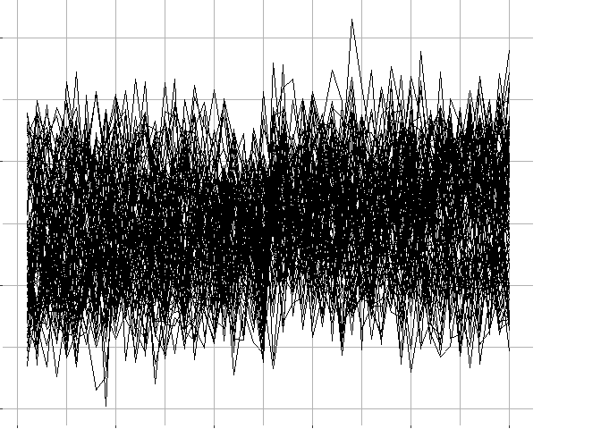

<!-- README.md is generated from README.Rmd. Please edit that file -->

# ppa

<!-- badges: start -->
<!-- badges: end -->

The goal of ppa is to provide an useable example implementation of plot
panel analysis. Plot panel analysis is a visualization technique that
can be used to rapidly explore and analyze a dataset when the
observations of interest are complex objects like time series or scatter
plots, rather than the individual data points that comprise those
objects. Plot panel analysis is especially important when no additional
variables exist that can help you organize and make sense of the
variation across the complex objects.

## Installation

You can install the development version of ppa from
[GitHub](https://github.com/) with:

``` r
# install.packages("devtools")
devtools::install_github("daattali/shinyalert") #requires dev version of shinyalert
devtools::install_github("jrodu/ppa")
```

## A simple motivational example

Consider the following set of time series


In the previous figure, the signal is relatively clear. However,
consider the following figures (these are the same time series from
above, but in the first figure the labels are correlated with the
variation across time series but noisy; in the second figure the labels
are random and thus are not useful):



In the last two situations, analysis would be difficult. No additional
variables are available that could help the analyst pull apart the time
series in a useful way. These figure alone are insufficient for
identifying the main signal present in the time series. Plot panel
analysis can help with this!

**But before we delve in to how plot panel analysis can help identify
signal across time series, let’s look at a much simpler problem that can
be solved incredibly fast with plot panel analysis…** Embedded in each
of these figures (including the first figure showing perfect signal) are
two “degenerate” time series that are just straight lines. Can you
identify them? Would you have known to look for them? If you could
identify them visually, could you quickly locate them in the dataset and
remove them from analysis?

This is easy to do with plot panel analysis (and using the ppa app).
Here are the steps.

1.  Run the following code in your console

``` r
example_data_from_paper %>% ppa(seconds, y, series, 'line')
```

2.  locate the two degenerate time series and click on them. They should
    turn grey.
3.  Click on the “Exclude/Unexclude Panels” checkbox.
4.  Click on the “exclude” button. The degenerate time series will
    disappear.
5.  Exit the app by closing the window.
6.  A vector called “excluded_panels” will show up in your environment
    which contains the identity of the two degenerate time series (the
    `series` variable in the original dataset)

**Simple!**

## Some features of the PPA app that are useful for plot panel analysis

Let’s take a look at some of the features of the PPA app. It’s easiest
to read this list while playing around with the app, so here are a few
examples you can run.

``` r
#example from above
example_data_from_paper %>% ppa(seconds, y, series, 'line')

#another dataset with more panels
example_data_no_row_col %>% ppa(x, y, z, 'line')

#another example where the grid row and column variable mapping are specified, ensuring that panels that belong in the same row (and/or column) are kept together appropriately.
example_data_with_row_col %>% ppa(x, y, z, 'line', rowgroup=rows, colgroup=cols)

#you can also specify only rowgroup or colgroup.
```

1.  Click on the “panel plot properties” button to
    - change the number of columns
    - change the height of the panels (expressed as a multiplier of the
      default size). The multiplier need not be an integer. The size of
      the panels is relative to the window size.
2.  The “Individual Panel Settings” checkbox
    - shows the x variable, the y variable, and the additional variables
      available in the dataset
    - allows you to toggle between plot types (currently “line” or
      “scatter”)
3.  The “Panel Shufflers” checkbox allows you to shuffle the panels
    either by shuffling the rows, shuffling the columns, shuffling the
    rows and columns (panels in the same row will stay in the same row,
    panels in the same column will stay in the same column, but the
    location of the rows/columns will change), or shuffling by panel
    without respect to row or column.
4.  The “Panel Selection Actions” checkbox allows you to
    - unselect currently selected panels (Unselect All)
    - zoom in on currently selected panels (Examine Selected)
    - undo the “zoom in” (Renturn to all panels)
5.  The “Exclude/Unexclude Panels” checkbox allows you to exclude
    selected panels (removes them from the plot) and unexclude all
    previously excluded panels.
6.  The “Label Panels and Select by Label” checkbox allows you to label
    panels (you first must “add” a label (or select a previously added
    label) and then apply it to the selected panels) and select panels
    (that have been previously labeled) by choosing a label or set of
    labels.
7.  The “Select Panels by Score Function” checkbox allows you to
    - create a function to “measure” each time series based on your
      visual observations
    - score each time series based on your function
    - select panels by moving the threshold on the resulting ECDF plot
    - invert the selected panels (i.e. selecting panels that lie “above”
      the threshold rather than “below”)
    - investigate the score of individual time series by hovering over
      them and exposing a tooltip.
8.  The “Select Panels by Comparison” checkbox allows you to do the same
    as selecting by score function, but using a user-suppled function
    that compares each panel to a selected panel.
9.  The “Arrange Panels in Scatter Plot” checkbox allows you to observe
    the relationship between two different measurement functions from
    the “Select by Score Function” module.
10. The “Transform Panels” checkbox allows you to rapidly investigate a
    data transformation or series of transformations.
    - When the first transformation is applied, a plot will appear in
      the right-hand column that is a tree plot that records the
      transformations attempted. Multiple transformations in succession
      will result in a series of nodes corresponding to a “branch” of
      the tree.  
    - To revert to a previous transformation (either to continue with
      analysis or create a new branch of successive transformations)
      simply click on the node on the tree corresponding to your desired
      transformation “state.” The plot panels will revert to that state,
      and you can apply the desired transformation (or continue your
      investigation) from there.

## A few tips and notes

1.  Plan to handle NAs in the plotting variables on your end for now.
    The plots will still render in the presence of NAs, but data in a 
    tibble that comes after an NA will not be plotted (so you may be left
    with only a portion of the plot).  When working inside the app, the main
    place this will matter is when using the "Transform Panels" functionality.
    Note that you can take care of NAs inside the transform function, so you
    need not avoid transformations that will produce NAs (i.e. a lag function
    or similar).  I plan to work on this for future updates.
2.  Have a set of score/compare/transform functions that you know a prior you 
    would like to use but don't want to re-type them into the
    function input boxes?  No problem!  Just make sure they are in your environment
    when you launch the app, and write a wrapper function for them in the input boxes
    in the app!
